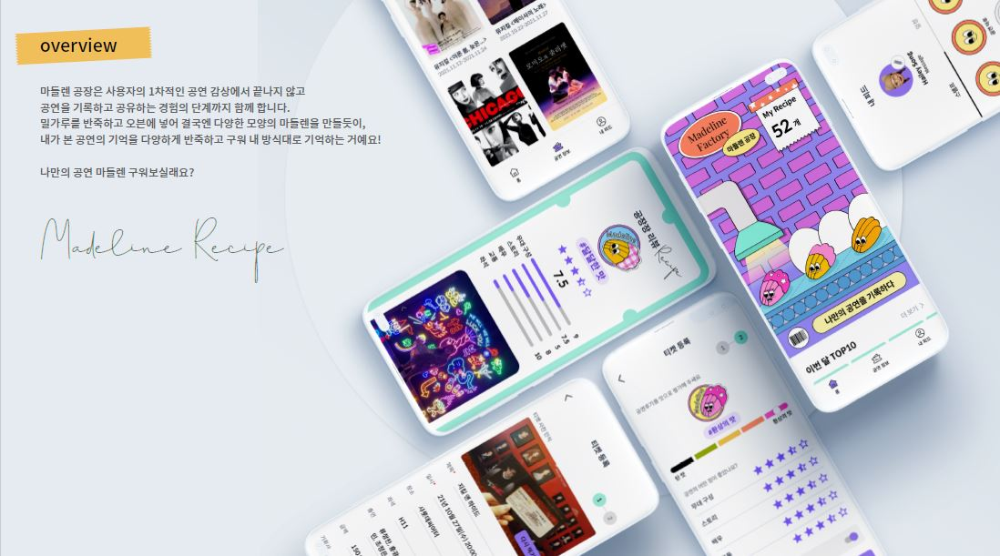
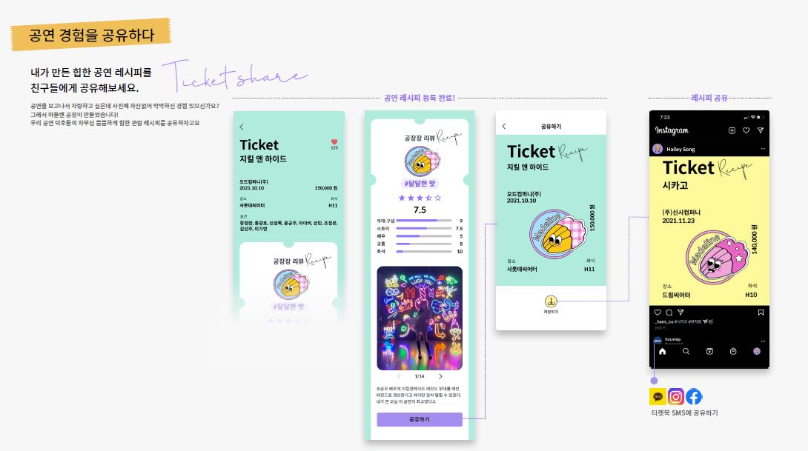
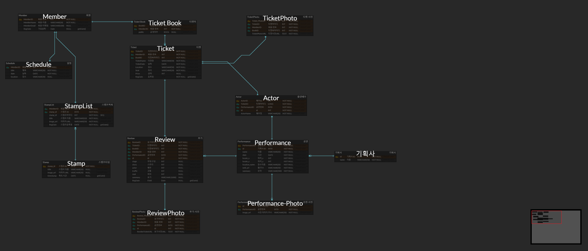

# Madeline Factory : culture-shock-Team-server

 

> 공연 후기를 힙하게 공유하는 법!&nbsp;&nbsp;마들렌 공장🥨

## Content

### Stacks
| category | stack |
|---|:---:|
| `Languate` | Kotlin |
| `Framework` | SpringBoot 2.5.4 |
| `DB` | AWS RDS, MariaDB 10.6, JPA, QueryDSL, inMemory/Test: H2|
| `Test` | JUnit5 |  
| `CI/CD` | GithubAction, Docker |
| `AWS`| EC2, S3 |
| `Auth`| JWT | 

### ERD

### CI/CD
-ing

### Period

2021.08 ~ 2022. 01

### Stacks

| 직군 | 이름 |
|---|:---:|
| `Designer` | 배유정 |
| `Designer` | 송혜원 |
| `Android Developer` | 이상은 |
| `Android Developer` | 김태성 |  
| `Server Developer` | 최푸름 |

### Issues? ##
If you find any issue, please raise an issue on the [Issue](https://github.com/DDD-6/CultureShock-Server/issues) page.

### License
- Code: [MIT](./LICENSE) © [PuReum Choi](https://blue-boy.tistory.com/)
